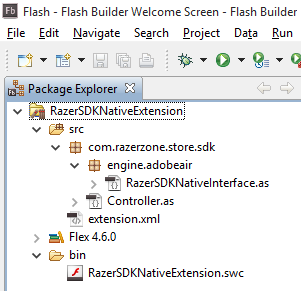
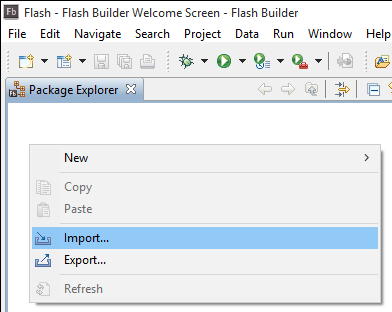
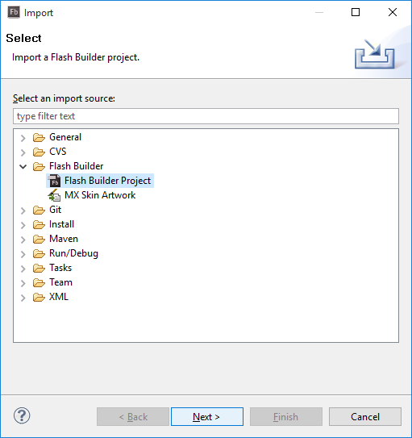
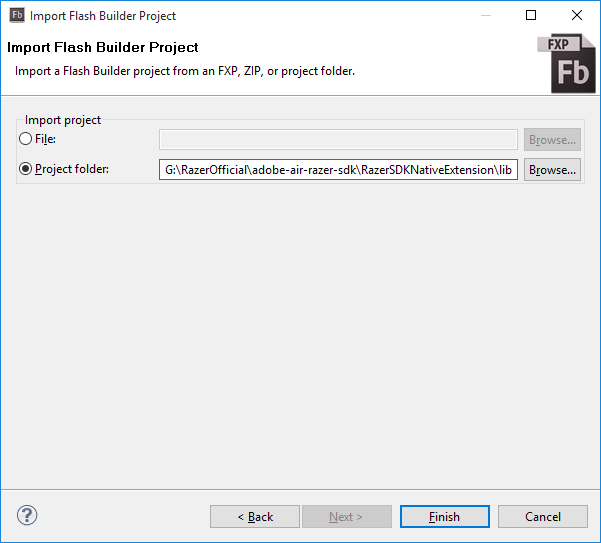
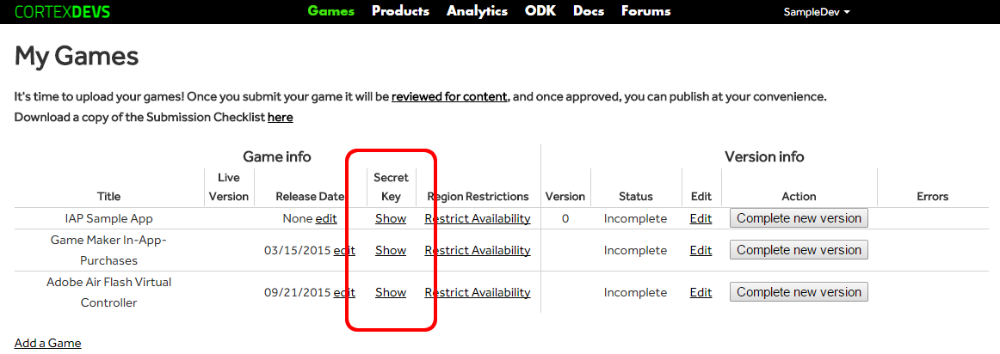
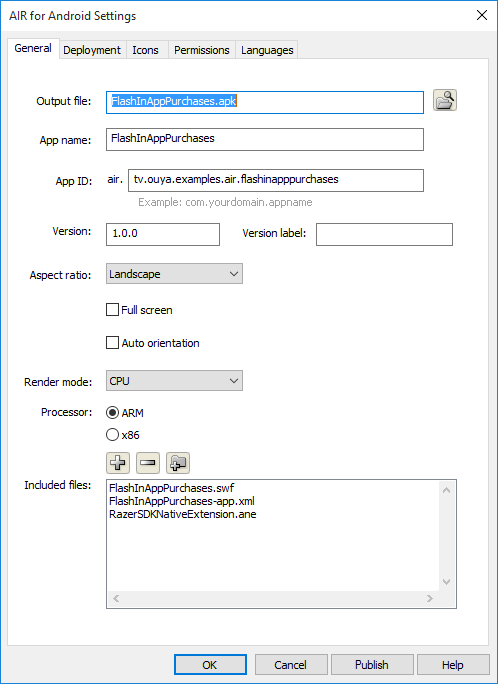

## Adobe Air Engine

# Source #

The source code for the Adobe Air / Animate CC/ Flash Plugin can be found at [adobe-air-razer-sdk](https://github.com/razerofficial/adobe-air-razer-sdk).

### Forums

[Forge TV on Razer Forums](https://insider.razerzone.com/index.php?forums/razer-forge-tv.126/)

[AIR Forums](http://forums.adobe.com/community/air)

[Flash Player Forums](http://forums.adobe.com/community/flashplayer)

## Guide

### Videos

* Packaging ANE/SWC/ZIP extensions in FlashDevelop - https://vimeo.com/32551703

* Android Native Extensions - Part 1 - http://gotoandlearn.com/play.php?id=148

* Android Native Extensions - Part 2 - http://gotoandlearn.com/play.php?id=149

### Resources

* Adobe Air SDK - http://www.adobe.com/devnet/air/air-sdk-download.html

* FlashDevelop - IDE - http://www.flashdevelop.org/

* FlashBuilder - http://www.adobe.com/products/flash-builder.html

* Flixel - Open source game-making library - http://flixel.org  

* Quick Guide to Creating and Using SWC - http://dev.tutsplus.com/tutorials/quick-guide-to-creating-and-using-swcs--active-1211

* ANEBUILDER - http://as3breeze.com/anebuilder/

* ANE-Wizard - https://github.com/freshplanet/ANE-Wizard

* [Adobe Scout](https://creative.adobe.com/products/scout) - Profiler Application

* [Adobe Scout APK](http://apkpure.com/adobe-scout/com.adobe.monocle.companion) - Sideload the Adobe Scout APK for profiing with Adobe Scout

# FlashDevelop/Flex/AdobeAirSDK

When compiling `FlashDevelop`, `Flex`, and the [AdobeAirSDK](http://www.adobe.com/devnet/air/air-sdk-download.html) you'll want to increase your Java Virtual Machine memory size. Normally the default is `384MB` but you can increase to `1GB` or higher ```java.args=-Xmx1024m```.

There are several locations where the `jvm.config` is configured.

```
C:\Users\[username]\AppData\Local\FlashDevelop\Apps\flexairsdk\4.6.0+16.0.0\bin\jvm.config
C:\Program Files\Adobe\Adobe Flash Builder 4.7 (64 Bit)\sdks\3.6.0\bin\jvm.config
C:\Program Files\Adobe\Adobe Flash Builder 4.7 (64 Bit)\sdks\4.6.0\bin\jvm.config
```

* The [FlashDevelop FAQ](http://www.flashdevelop.org/wikidocs/index.php?title=F.A.Q) needs your `JAVA_HOME` to point the `JDK6` (32-bit). 

# Building ANE

ANE Extensions wrap Java libraries so they can be invoked from Adobe Air ActionScript.

## Build AirRazerSDKPlugin JAR

The Java Plugin JAR needs to be compiled first before it can be wrapped in an ANE Extension.

[AirRazerSDKPlugin](https://github.com/razerofficial/adobe-air-razer-sdk/tree/master/RazerSDKNativeExtension/AirRazerSDKPlugin) is an Android Studio library project that compiles into an AAR library.

The `AIR Compiler` does not have support for the [AAR format](http://tools.android.com/tech-docs/new-build-system/aar-format) yet. The build uses a script to create a JAR from the AAR library that the `AIR Compiler` can use.

The [build_all.cmd](https://github.com/razerofficial/adobe-air-razer-sdk/blob/master/RazerSDKNativeExtension/build_all.cmd) script will compile the `AirRazerSDKPlugin` and combine the [dependencies](https://github.com/razerofficial/adobe-air-razer-sdk/tree/master/RazerSDKNativeExtension/AirRazerSDKPlugin/java/libs) into the `AirRazerSDKPPlugin.JAR` to build the `ANE`. The script automatically copies the built `ANE` to the example projects.

## ANE Extension Interface

The extension interface is the piece between Java and ActionScript and was created using a [FlashBuilder project](https://github.com/razerofficial/adobe-air-razer-sdk/tree/master/RazerSDKNativeExtension/lib). `FlashBuilder` is part of `Adobe Creative Cloud`.


After the builder project has imported, `Adobe Builder` will auto compile the `SWC` file which is needed any time ActionScript is changed in the `ANE`.



1) In `Flash Builder` choose the `File->Import Flash Builder Project` menu item.


Or `Right-Click` the `Project Explorer` and click `Import...`.



In the Import Dialog select `Flash Builder Project`.



2) Choose `Project Folder`, browse to the `RazerSDKNativeExtension/lib` folder, and click `Finish`.



3) After making changes to `ActionScript` switch back to `Flash Builder` which will auto-generate a new `SWC` file.

4) Building the `ANE` from script will embed the `SWC` file.

5) The `Project->Clean...` menu item will also rebuild the `ANE`.

## Build ANE

[build_ane.cmd](https://github.com/razerofficial/adobe-air-razer-sdk/blob/master/RazerSDKNativeExtension/build_ane.cmd) will package the `RazerSDKNativeExtension.ane` on Windows. Be sure to customize the paths for `JDK` and `AIR_SDK` pointing at the [AdobeAirSDK](http://www.adobe.com/devnet/air/air-sdk-download.html) in the build script.

## Using ANE

The [RazerSDKNativeExtension.ane](https://github.com/razerofficial/adobe-air-razer-sdk/blob/master/RazerSDKNativeExtension/RazerSDKNativeExtension.ane) should be used as a library after placing in the following folders in a FlashDevelop project.

```
lib\RazerSDKNativeExtension.ane
extension\release\RazerSDKNativeExtension.ane
```

For the debug extension folder, extract the contents of `RazerSDKNativeExtension.ane` into a subfolder named `RazerSDKNativeExtension.ane`.

```
extension\debug\RazerSDKNativeExtension.ane\catalog.xml
extension\debug\RazerSDKNativeExtension.ane\library.swf
```

### Edit `application.xml`

Add the `RazerSDKNativeExtension.ane` extension to your application's extensions.

```
  <extensions>
	<extensionID>com.razerzone.store.sdk.engine.adobeair.razersdknativecontext</extensionID>
  </extensions>
```

# RazerSDK Native Extension

Import the packages to use the RazerSDK Native Extension.

```
import tv.ouya.console.api.OuyaController;
import tv.ouya.sdk.OuyaNativeInterface;
```

## RazerSDKInit

Initialize the `RazerSDKNativeInterface` to use OUYA-Everywhere Input. The `RazerSDKNativeExtension.ane` extension must be added to your project. 

```
trace( "Initialize RazerSDK Extension..." );
var ouyaNativeInterface:RazerSDKNativeInterface = new RazerSDKNativeInterface();
ouyaNativeInterface.RazerSDKInit();
```

## IsAnyConnected

`IsAnyConnected` will return `true` if any controllers are connected, otherwise `false`.

```
var anyConnected:Boolean = RazerSDKNativeInterface.IsAnyConnected();
```

## IsConnected

`IsConnected` will return `true` if the `playerNum` controller is connected.

```
var playerNum:int = 0;
var isConnected:Boolean = RazerSDKNativeInterface.IsConnected(playerNum);
```

## GetAxis

`GetAxis` will return the `Number` value for the supplied `playerNum` controller and `axis`.

```
var playerNum:int = 0;
var axis:int = Controller.AXIS_LS_X;
var val:Number = razerSDKNativeInterface.GetAxis(playerNum, axis);
```

The supported `axis` values are below.

```
Controller.AXIS_LS_X
Controller.AXIS_LS_Y
Controller.AXIS_RS_X
Controller.AXIS_RS_Y
Controller.AXIS_L2
Controller.AXIS_R2
```

## GetAnyButton

`GetAnyButton` will return `true` if any controller is pressing the `button`.

```
var button:int = Controller.BUTTON_O;
var pressed:Boolean = razerSDKNativeInterface.GetAnyButton(button);
```

The supported `button` values are below.

```
Controller.BUTTON_O
Controller.BUTTON_U
Controller.BUTTON_Y
Controller.BUTTON_A
Controller.BUTTON_L1
Controller.BUTTON_R1
Controller.BUTTON_L3
Controller.BUTTON_R3
Controller.BUTTON_DPAD_UP
Controller.BUTTON_DPAD_DOWN
Controller.BUTTON_DPAD_RIGHT
Controller.BUTTON_DPAD_LEFT
Controller.BUTTON_MENU
```

`BUTTON_MENU` should only be used with `ButtonDown` and `ButtonUp` events.

## GetAnyButtonDown

`GetAnyButtonDown` will return `true` if any controller detected a pressed event on the last frame for the `button`.

```
var button:int = Controller.BUTTON_O;
var pressed:Boolean = razerSDKNativeInterface.GetAnyButtonDown(button);
```

## GetAnyButtonUp 

`GetAnyButtonUp` will return `true` if any controller detected a released event on the last frame for the `button`.

```
var button:int = Controller.BUTTON_O;
var released:Boolean = razerSDKNativeInterface.GetAnyButtonUp(button);
```

## GetButton

`GetButton` will return `true` if the `playerNum` controller is pressing the `button`.

```
var playerNum:int = 0;
var button:int = Controller.BUTTON_O;
var pressed:Boolean = razerSDKNativeInterface.GetButton(playerNum, button);
```

## GetButtonDown

`GetButtonDown` will return `true` if the `playerNum` controller detected a pressed event on the last frame for the `button`.

```
var playerNum:int = 0;
var button:int = Controller.BUTTON_O;
var pressed:Boolean = razerSDKNativeInterface.GetButtonDown(playerNum, button);
```

## GetButtonUp

`GetButtonUp` will return `true` if the `playerNum` controller detected a released event on the last frame for the `button`.

```
var playerNum:int = 0;
var button:int = Controller.BUTTON_O;
var released:Boolean = razerSDKNativeInterface.GetButtonUp(playerNum, button);
```

## ClearButtonStatesPressedReleased

`ClearButtonStatesPressedReleased` will clear the detected pressed and released states to allow detection for the next update frame.

```
razerSDKNativeInterface.ClearButtonStatesPressedReleased();
```

## Examples

### Flash

The following steps setup the `Main.as` ActionScript file to load at start-up to initialize the `RazerSDK` native extension.

1) Switch to the `selection tool` and `left-click` on the stage to select the document.


2) In the `Property` window change the `Class` field to `Main` to reference the `Main.as`.

3) Also set the document size to `1920x1080`.

4) To the right of the `Class` field there's an edit button to open the existing `Main.as` or use the file menu to create a new `Main.as` action script document.

5) Create a bare-bones `Main` class. When the application starts, the first thing that will be called is the `Main` constructor.

```
package
{
    import flash.display.MovieClip;

    public class Main extends MovieClip
    {
        public function Main()
        {
		}
	}
}
```

6) Add code to load the `RazerSDK` native extension and save a reference to the native interface.

```
package
{
    import flash.display.MovieClip;
	import tv.ouya.sdk.OuyaNativeInterface;

    public class Main extends MovieClip
    {
		// reference to the native interface
		var _mRazerSDKNativeInterface: RazerSDKNativeInterface;

        public function Main()
        {
			// create the native interface and initialize the RazerSDK native extension
			_mRazerSDKNativeInterface = new RazerSDKNativeInterface();

			// initialize the RazerSDK plugin
			_mRazerSDKNativeInterface.RazerSDKInit();
		}
	}
}
```

7) Open the `File->Air 17.0 for Android Settings` menu item.


8) On the `Deployment` tab, the `Certificate` field must be set. You can either browse to an existing `p12` certificate or create one with the `Create` button. This field must be set before clicking the `Publish` button. If `Remember password for this session` is set you can publish directly from the `File->Publish` menu item. Publishing will produce an `APK` file which can be installed on the command-line. All the `Flash` examples use `android` for the certificate password.

`adb install -r application.apk`


9) On the `General` tab, the `App ID` field should match the `package identifier` that was created in the [developer portal](http://devs.ouya.tv). Notice that `Adobe-Air` apps are always prefixed with `air`.


10) Select the `ARM` processor and click the `+` button to browse to the `RazerSDKNativeExtension.ane` copied to your project folder and click `OK`.

11) When publishing, the `extensions` section will automatically appear in your project's `ApplicationName-app.xml` file and that section cannot be edited manually.

```
  <extensions>
    <extensionID>com.razerzone.store.sdk.engine.adobeair.razersdknativecontext</extensionID>
  </extensions>
```

11) Edit your project's `ApplicationName-app.xml` to add the following manifest additions.

```
<application xmlns="http://ns.adobe.com/air/application/17.0">
	<android> 
		  <manifestAdditions>
		  <![CDATA[
				<manifest>
					<uses-permission android:name="android.permission.WAKE_LOCK" />
					<application>
						<activity>
							<intent-filter>
								<action android:name="android.intent.action.MAIN"/>
								<category android:name="android.intent.category.LAUNCHER"/>
								<category android:name="android.intent.category.LEANBACK_LAUNCHER"/>
								<category android:name="com.razerzone.store.category.GAME" />
							</intent-filter>
						</activity>
					</application>
				</manifest>
			]]>
		</manifestAdditions>
	</android> 	
```

12) Open the `File->Open ActionScript Settings` menu item.


13) On the `Library Path` tab, click the `Browse to Native Extension` button to select the `RazerSDKNativeExtension.ane` file in the project folder.


14) With the `RazerSDKNativeExtension.ane` added to the library path, click `OK`. This setting uses an absolute path and if the path is different then the path will need to be reset in order to publish. 


### Flash Virtual Controller

The [Flash Virtual Controller](https://github.com/razerofficial/adobe-air-razer-sdk/tree/master/FlashVirtualController) example shows 4 images of the OUYA Controller which moves axises and highlights buttons when the physical controller is manipulated.


1) The Virtual Controller example modifies the `Main.as` ActionScript to add an update event that will later control sprite visibility.

```
package
{
    import flash.display.MovieClip;
	import flash.events.Event;
	import tv.ouya.sdk.OuyaNativeInterface;

    public class Main extends MovieClip
    {
		// reference to the native interface
		var _mOuyaNativeInterface: OuyaNativeInterface;

		// frame event listener
		private function fl_EnterFrameHandler_1(event:Event):void
		{
		}

        public function Main()
        {
			// create the native interface and initialize the OUYA native extension
			_mOuyaNativeInterface = new OuyaNativeInterface();

			// initialize the OUYA plugin
			_mOuyaNativeInterface.OuyaInit();

			// add an event listener for each frame
			addEventListener(Event.ENTER_FRAME, fl_EnterFrameHandler_1);
		}
	}
}
```

2) In the update event, `ClearButtonStatesPressedReleased` will clear the button pressed and release states each update frame.

```
package
{
    import flash.display.MovieClip;
	import flash.events.Event;
	import tv.ouya.sdk.OuyaNativeInterface;

    public class Main extends MovieClip
    {
		// reference to the native interface
		var _mOuyaNativeInterface: OuyaNativeInterface;

		// frame event listener
		private function fl_EnterFrameHandler_1(event:Event):void
		{
			// clear the button pressed and released states each frame
			_mOuyaNativeInterface.ClearButtonStatesPressedReleased();
		}

        public function Main()
        {
			// create the native interface and initialize the OUYA native extension
			_mOuyaNativeInterface = new OuyaNativeInterface();

			// initialize the OUYA plugin
			_mOuyaNativeInterface.OuyaInit();

			// add an event listener for each frame
			addEventListener(Event.ENTER_FRAME, fl_EnterFrameHandler_1);
		}
	}
}
```

3) The update event can fire hundreds of times per second, where the input can be checked far less often. Use a time limitor to throttle-down checking input.

```
package
{
    import flash.display.MovieClip;
	import flash.events.Event;
	import tv.ouya.sdk.OuyaNativeInterface;

    public class Main extends MovieClip
    {
		// the amount of time to wait in milliseconds between checking input
		var INTERVAL_MS_INPUT:Number = 10;

		// reference to the native interface
		var _mOuyaNativeInterface: OuyaNativeInterface;

		// a timer to throttle checking input
		var _mInputTimer:Number = 0;

		// frame event listener
		private function fl_EnterFrameHandler_1(event:Event):void
		{
			// use the date to access time
			var date:Date = new Date();

			// check the time interval
			if (_mInputTimer < date.getTime())
			{
				// add an input delay
				_mInputTimer = date.getTime() + INTERVAL_MS_INPUT;

				// clear the button pressed and released states each frame
				_mOuyaNativeInterface.ClearButtonStatesPressedReleased();
			}
		}

        public function Main()
        {
			// create the native interface and initialize the OUYA native extension
			_mOuyaNativeInterface = new OuyaNativeInterface();

			// initialize the OUYA plugin
			_mOuyaNativeInterface.OuyaInit();

			// add an event listener for each frame
			addEventListener(Event.ENTER_FRAME, fl_EnterFrameHandler_1);
		}
	}
}
```

4) The `VirtualController` object is used to create sprites for each of the virtual controllers on screen.

```
package
{
    import flash.display.MovieClip;
	import flash.events.Event;
	import tv.ouya.sdk.OuyaNativeInterface;

    public class Main extends MovieClip
    {
		// the amount of time to wait in milliseconds between checking input
		var INTERVAL_MS_INPUT:Number = 10;

		// reference to the native interface
		var _mOuyaNativeInterface: OuyaNativeInterface;

		// a timer to throttle checking input
		var _mInputTimer:Number = 0;

		// Virtual controller references
		var _mVirtualController1: VirtualController;
		var _mVirtualController2: VirtualController;
		var _mVirtualController3: VirtualController;
		var _mVirtualController4: VirtualController;

		// frame event listener
		private function fl_EnterFrameHandler_1(event:Event):void
		{
			// use the date to access time
			var date:Date = new Date();

			// check the time interval
			if (_mInputTimer < date.getTime())
			{
				// add an input delay
				_mInputTimer = date.getTime() + INTERVAL_MS_INPUT;

				// update the virtual controller sprites each frame
				_mVirtualController1.Update();
				_mVirtualController2.Update();
				_mVirtualController3.Update();
				_mVirtualController4.Update();

				// clear the button pressed and released states each frame
				_mOuyaNativeInterface.ClearButtonStatesPressedReleased();
			}
		}

        public function Main()
        {
			// create the native interface and initialize the OUYA native extension
			_mOuyaNativeInterface = new OuyaNativeInterface();

			// initialize the OUYA plugin
			_mOuyaNativeInterface.OuyaInit();

			// create the virtual controller sprites on start and specify the playerNum along with where to place on screen
			_mVirtualController1 = new VirtualController(this, _mOuyaNativeInterface, 0, 15.65, -75.1);
			_mVirtualController2 = new VirtualController(this, _mOuyaNativeInterface, 1, 1232.55, -75.1);
			_mVirtualController3 = new VirtualController(this, _mOuyaNativeInterface, 2, 15.65, 495.75);
			_mVirtualController4 = new VirtualController(this, _mOuyaNativeInterface, 3, 1232.55, 495.75);

			// add an event listener for each frame
			addEventListener(Event.ENTER_FRAME, fl_EnterFrameHandler_1);
		}
	}
}
```

5) The `VirtualController` object uses the native interface in the `Update` method to access axis and button values for the controller.

```
		public function Update():void
		{
			UpdateVisibility(_mButtonO, _mOuyaNativeInterface.GetButton(_mPlayerNum, OuyaController.BUTTON_O));
			UpdateVisibility(_mButtonU, _mOuyaNativeInterface.GetButton(_mPlayerNum, OuyaController.BUTTON_U));
			UpdateVisibility(_mButtonY, _mOuyaNativeInterface.GetButton(_mPlayerNum, OuyaController.BUTTON_Y));
			UpdateVisibility(_mButtonA, _mOuyaNativeInterface.GetButton(_mPlayerNum, OuyaController.BUTTON_A));
			
			UpdateVisibility(_mButtonL1, _mOuyaNativeInterface.GetButton(_mPlayerNum, OuyaController.BUTTON_L1));
			
			UpdateVisibility(_mButtonL3, _mOuyaNativeInterface.GetButton(_mPlayerNum, OuyaController.BUTTON_L3));
			UpdateVisibility(_mButtonLS, !_mOuyaNativeInterface.GetButton(_mPlayerNum, OuyaController.BUTTON_L3));
			
			UpdateVisibility(_mButtonR1, _mOuyaNativeInterface.GetButton(_mPlayerNum, OuyaController.BUTTON_R1));			
			
			UpdateVisibility(_mButtonR3, _mOuyaNativeInterface.GetButton(_mPlayerNum, OuyaController.BUTTON_R3));
			UpdateVisibility(_mButtonRS, !_mOuyaNativeInterface.GetButton(_mPlayerNum, OuyaController.BUTTON_R3));
			
			UpdateVisibility(_mButtonDpadDown, _mOuyaNativeInterface.GetButton(_mPlayerNum, OuyaController.BUTTON_DPAD_DOWN));
			UpdateVisibility(_mButtonDpadLeft, _mOuyaNativeInterface.GetButton(_mPlayerNum, OuyaController.BUTTON_DPAD_LEFT));
			UpdateVisibility(_mButtonDpadRight, _mOuyaNativeInterface.GetButton(_mPlayerNum, OuyaController.BUTTON_DPAD_RIGHT));
			UpdateVisibility(_mButtonDpadUp, _mOuyaNativeInterface.GetButton(_mPlayerNum, OuyaController.BUTTON_DPAD_UP));
			
			var date:Date = new Date();
			if (_mOuyaNativeInterface.GetButtonUp(_mPlayerNum, OuyaController.BUTTON_MENU))
			{
				_mMenuTimer = date.getTime() + 1000;
			}
			UpdateVisibility(_mButtonMenu, date.getTime() < _mMenuTimer);
			
			var lsX = _mOuyaNativeInterface.GetAxis(_mPlayerNum, OuyaController.AXIS_LS_X);
			var lsY = _mOuyaNativeInterface.GetAxis(_mPlayerNum, OuyaController.AXIS_LS_Y);
			var rsX = _mOuyaNativeInterface.GetAxis(_mPlayerNum, OuyaController.AXIS_RS_X);
			var rsY = _mOuyaNativeInterface.GetAxis(_mPlayerNum, OuyaController.AXIS_RS_Y);
			var l2 = _mOuyaNativeInterface.GetAxis(_mPlayerNum, OuyaController.AXIS_L2);
			var r2 = _mOuyaNativeInterface.GetAxis(_mPlayerNum, OuyaController.AXIS_R2);
			
			UpdateVisibility(_mButtonL2, l2 > DEADZONE);
			UpdateVisibility(_mButtonR2, r2 > DEADZONE);
			
			//rotate input by N degrees to match image
			var degrees:Number = 135;
			var radians:Number = degrees / 180.0 * 3.14;
			var cos:Number = Math.cos(radians);
			var sin:Number = Math.sin(radians);
			
			
			MoveBitmap(_mButtonL3, AXIS_SCALAR * (lsX * cos - lsY * sin), AXIS_SCALAR * (lsX * sin + lsY * cos));
			MoveBitmap(_mButtonLS, AXIS_SCALAR * (lsX * cos - lsY * sin), AXIS_SCALAR * (lsX * sin + lsY * cos));
			
			MoveBitmap(_mButtonR3, AXIS_SCALAR * (rsX * cos - rsY * sin), AXIS_SCALAR * (rsX * sin + rsY * cos));
			MoveBitmap(_mButtonRS, AXIS_SCALAR * (rsX * cos - rsY * sin), AXIS_SCALAR * (rsX * sin + rsY * cos));	
		}
```

6) The sprites used by the example are first imported to the library from `PNG` files. Use the `File->Import->Import to Library` menu item to select the images in the project folder.


7) Switch to the `library` tab and `right-click` the imported images to select `Properties...`.


8) Switch the the `ActionScript` tab and enable `Export for ActionScript` and `Export in frame 1`. Set the `Class` field to a name and be sure to capitalize the first letter by convention. Click `OK`. Repeat for all of the image sprites.


9) The `VirtualController` constructor keeps a reference to the `Main` object and the `OuyaNativeInterface` object. The `Main` object is needed to dynamically add children to the stage document. The `PlayerNum` argument corresponds to the `OUYA` controller number. The `x` and `y` parameter indicates where to instantiate the `Bitmap` objects on the stage.

```
package
{
	import flash.display.Bitmap;
	import flash.display.BitmapData;
    import flash.display.MovieClip;
	import flash.display.PixelSnapping;
	import flash.geom.Matrix;
	import tv.ouya.console.api.OuyaController;
	import tv.ouya.sdk.OuyaNativeInterface;

    public class VirtualController extends MovieClip
    {
		// reference to the Main document
		var _mMain: Main;

		// reference to the native interface
		var _mOuyaNativeInterface: OuyaNativeInterface;
		
		// player number for the virtual controller sprite collection
		var _mPlayerNum:int = 0;
		
		// X-position for the sprite controller
		var _mX:Number = 0;

		// Y-position for the sprite controller
		var _mY:Number = 0;

		// constructor for the Virtual Controller
		public function VirtualController(main:Main, ane:OuyaNativeInterface, playerNum:int, x:Number, y:Number)
        {
			_mMain = main;
			_mOuyaNativeInterface = ane;
			_mPlayerNum = playerNum;
			_mX = x;
			_mY = y;
		}
	}
}
```

10) The `VirtualController` constructor uses a helper method to add scaled sprites to the stage document.

```
		private function AddBitmap(bitmap : Bitmap) : Bitmap
		{
			var scale:Number = 2;
			var matrix:Matrix = new Matrix();
			matrix.scale(scale, scale);

			var resizedBitmapData:BitmapData = new BitmapData(bitmap.width * scale, bitmap.height * scale, true, 0x000000);
			resizedBitmapData.draw(bitmap, matrix, null, null, null, true);

			var resizedBitmap = new Bitmap(resizedBitmapData, PixelSnapping.NEVER, true);
			
			resizedBitmap.x = _mX;
			resizedBitmap.y = _mY;
			
			_mMain.addChild(resizedBitmap);
			return resizedBitmap;
		}
```

11) The `VirtualController` constructor instantiates the sprite objects from the library.

```
		// sprite references
		var _mController:Bitmap;
		var _mButtonO:Bitmap;
		var _mButtonU:Bitmap;
		var _mButtonY:Bitmap;
		var _mButtonA:Bitmap;
		var _mButtonL1:Bitmap;
		var _mButtonL2:Bitmap;
		var _mButtonL3:Bitmap;
		var _mButtonR1:Bitmap;
		var _mButtonR2:Bitmap;
		var _mButtonR3:Bitmap;
		var _mButtonLS:Bitmap;
		var _mButtonRS:Bitmap;
		var _mButtonDpadDown:Bitmap;
		var _mButtonDpadLeft:Bitmap;
		var _mButtonDpadRight:Bitmap;
		var _mButtonDpadUp:Bitmap;
		var _mButtonMenu:Bitmap;

		public function VirtualController(main:Main, ane:OuyaNativeInterface, playerNum:int, x:Number, y:Number)
        {
			_mMain = main;
			_mOuyaNativeInterface = ane;
			_mPlayerNum = playerNum;
			_mX = x;
			_mY = y;

			_mController = AddBitmap(new Bitmap(new ImageController()));
			_mButtonO = AddBitmap(new Bitmap(new ImageO()));
			_mButtonU = AddBitmap(new Bitmap(new ImageU()));
			_mButtonY = AddBitmap(new Bitmap(new ImageY()));
			_mButtonA = AddBitmap(new Bitmap(new ImageA()));		
			_mButtonL1 = AddBitmap(new Bitmap(new ImageL1()));
			_mButtonL2 = AddBitmap(new Bitmap(new ImageL2()));
			_mButtonL3 = AddBitmap(new Bitmap(new ImageL3()));
			_mButtonR1 = AddBitmap(new Bitmap(new ImageR1()));
			_mButtonR2 = AddBitmap(new Bitmap(new ImageR2()));
			_mButtonR3 = AddBitmap(new Bitmap(new ImageR3()));
			_mButtonLS = AddBitmap(new Bitmap(new ImageLS()));
			_mButtonRS = AddBitmap(new Bitmap(new ImageRS()));
			_mButtonDpadDown = AddBitmap(new Bitmap(new ImageDpadDown()));
			_mButtonDpadLeft = AddBitmap(new Bitmap(new ImageDpadLeft()));
			_mButtonDpadRight = AddBitmap(new Bitmap(new ImageDpadRight()));
			_mButtonDpadUp = AddBitmap(new Bitmap(new ImageDpadUp()));
			_mButtonMenu = AddBitmap(new Bitmap(new ImageMenu()));
        }
```

12) The `Update` method uses a helper method to update `Bitmap` visibility.

```
		private function UpdateVisibility(bitmap:Bitmap, show:Boolean) : void
		{
			if (show)
			{
				bitmap.alpha = 1;
			}
			else
			{
				bitmap.alpha = 0;
			}
		}
```

13) The `Update` method uses a helper method to move the left and right stick sprites.

```
		private function MoveBitmap(bitmap : Bitmap, offsetX : Number, offsetY : Number) : void
		{
			bitmap.x = _mX + offsetX;
			bitmap.y = _mY + offsetY;
		}
```

### In-App-Purchases

The [In-App-Purchases](https://github.com/razerofficial/adobe-air-razer-sdk/tree/master/FlashInAppPurchases) example uses the ODK to access gamer info, purchasing, and receipts.


1) Log into the [`developer portal`](http://devs.ouya.tv), and switch to the `Games` section.



2) In the `Games` section of the `developer portal` create an entry matching your `package name` matching the `air` prefix. Record the `Secret API Key` for the corresponding game entry to configure in-app-purchases.

3) Use the `File->AIR Android Settings..` menu item to open the `AIR for Android Settings` dialog.  


4) On the `General` tab, verify the `App ID:` matches the package identifier in the game entry.



5) The IAP example modifies the `Main.as` ActionScript to add an update event that will control the stage text content. The `Main` constructor initializes the ANE interface and initializes the ANE.

```
package
{
	// Import the MovieClip namespace
    import flash.display.MovieClip;

	// The Controller keycodes are used by input events
	import com.razerzone.store.sdk.Controller;	

	// Import the namespace for the ANE
	import com.razerzone.store.sdk.engine.adobeair.RazerSDKNativeInterface;	

	// The Main document extends from MovieClip 
    public class Main extends MovieClip
    {
		// Log into the http://devs.ouya.tv developer portal to get the game entry SECRET API KEY
		static var SECRET_API_KEY:String = "eyJkZXZlbG9wZXJfaWQiOiIzMTBhOGY1MS00ZDZlLTRhZTUtYmRhMC1iOTM4NzhlNWY1ZDAiLCJkZXZlbG9wZXJfcHVibGljX2tleSI6Ik1JR2ZNQTBHQ1NxR1NJYjNEUUVCQVFVQUE0R05BRENCaVFLQmdRRFYyd0RKRVdoRVNUdmtEcjBJWDNnUFc4N0pZMjgyT3ZqaGtsZWUwSUt6bFAzNVNtM1hlRGd4dU9SbkQzaUFta2YwRlo0L1VUWnBuTUhSVHhnNDBPTWZIYm4zSlVDUGdFdDJmTWZkL2ZVNU4vR2VqeTh2RE1nR092d2FlbUsvWU9NVHMyc2ZnTmduYVRJa3JFNVg5OFFKcGhaenlDY3cwUUZXaEdIczh1eCswUUlEQVFBQiJ9";

		// save a reference to the ANE interface
		var _mRazerSDKNativeInterface: RazerSDKNativeInterface;

		// The main constructor
        public function Main()
        {
			// create an instance of the ANE interface
			_mRazerSDKNativeInterface = new RazerSDKNativeInterface();

			// Initialize the ANE by passing the game's secret api key
			_mRazerSDKNativeInterface.RazerSDKInit(SECRET_API_KEY);
		}
	}
}
```

6) In order to receive IAP extents, use the ANE interface `context` to add a listener to get status events.

```
		// callback for context status events
		private function onStatusEvent( _event : StatusEvent ) : void 
		{
			// status events have a String code
			_mRazerSDKNativeInterface.LogInfo("Code: " + _event.code );

			// status events have a String level
			_mRazerSDKNativeInterface.LogInfo("Level: " + _event.level );
		}

		// The main constructor
        public function Main()
        {
			// create an instance of the ANE interface
			_mRazerSDKNativeInterface = new RazerSDKNativeInterface();

			// Initialize the ANE by passing the game's secret api key
			_mRazerSDKNativeInterface.RazerSDKInit(SECRET_API_KEY);

			// Add a status event listener on the ANE context
			_mRazerSDKNativeInterface.GetExtensionContext().addEventListener( StatusEvent.STATUS, onStatusEvent );
		}
}
```

7) `Context` status events provide `IAP` callbacks and latency free input. The `event` code indicates the type of event. And the `event` level was used to pass a `JSON` string with the data for the event. The example includes all the parsing logic for the `JSON` responses.

```
		private function onStatusEvent( _event : StatusEvent ) : void 
		{
			if (_event.code == "Axis") {
				Axis(_event.level);
				return;
			} else if (_event.code == "ButtonDown") {
				ButtonDown(_event.level);
				return;
			} else if (_event.code == "ButtonUp") {
				ButtonUp(_event.level);
				return;
			}
			
			// Display status events in the example label
			LblStatus.text = "STATUS: "+_event.code;
			
			if (_event.code == "InitCompleteOnSuccess") {			
				InitCompleteOnSuccess();
			} else if (_event.code == "RequestGamerInfoOnSuccess") {
				RequestGamerInfoOnSuccess(_event.level);
			} else if (_event.code == "RequestGamerInfoError" ||
				_event.code == "RequestProductsError" ||
				_event.code == "RequestPurchaseError" ||
				_event.code == "RequestReceiptsError" ||
				_event.code == "InitCompleteOnFailure" ||
				_event.code == "RequestGamerInfoOnFailure" ||
				_event.code == "RequestProductsOnFailure" ||
				_event.code == "RequestPurchaseOnFailure" ||
				_event.code == "RequestReceiptsOnFailure" ||
				_event.code == "ShutdownOnFailure"||
				_event.code == "RequestGamerInfoOnCancel" ||
				_event.code == "RequestProductsOnCancel" ||
				_event.code == "RequestPurchaseOnCancel" ||
				_event.code == "RequestReceiptsOnCancel") {
				OnGenericError(_event.code, _event.level);
			} else if (_event.code == "RequestProductsOnSuccess") {
				RequestProductsOnSuccess(_event.level);
			} else if (_event.code == "RequestPurchaseOnSuccess") {
				RequestPurchaseOnSuccess(_event.level);
			} else if (_event.code == "RequestReceiptsOnSuccess") {
				RequestReceiptsOnSuccess(_event.level);
			} else if (_event.code == "ShutdownSuccess") {
				ShutdownOnSuccess();
			} else {
				_mRazerSDKNativeInterface.LogInfo("Code: " + _event.code );
				_mRazerSDKNativeInterface.LogInfo("Level: " + _event.level );
			}
		}
``` 

## IAP

`IAP` methods use the reference to the `ANE` interface and the `context` status events to get responses.

### RequestProducts

`RequestProducts` takes a `JSONArray` of `String` product identifiers to get the details about the `entitlement` or `consumable`.

```
var jsonData:String = "[\"long_sword\",\"sharp_axe\",\"__DECLINED__THIS_PURCHASE\"]";
_mRazerSDKNativeInterface.RequestProducts(jsonData);
```

### RequestPurchase

`RequestPurchase` takes a `String` identifier for the `entitlement` or `consumable` being purchased.

```
var identifier:String = "long_sword";
_mRazerSDKNativeInterface.RequestPurchase(identifier);
```

### RequestReceipts

`RequestReceipts` takes no arguments and the callback gets a list of receipts that the logged in gamer has purchased associated with the package.

```
_mRazerSDKNativeInterface.RequestReceipts();
```

### RequestGamerInfo

`RequestGamerInfo` gets the `GamerInfo` for the logged in gamer. The `GamerInfo` holds the gamer `UUID` and `Username`.

```
_mRazerSDKNativeInterface.RequestGamerInfo();
```

### Shutdown

`Shutdown` cleanly shuts down the `ANE` interface before exiting. Use the `ShutdownOnSuccess` callback to exit at the right time.

Import the `NativeApplication` namespace to get access to the singleton and exit method.

```
import flash.desktop.NativeApplication;
```

Shutdown the `ANE` interface before exiting the application.

```
		private function StartShutdown():void
		{
			_mOuyaNativeInterface.Shutdown();
		}

		private function ShutdownOnSuccess():void
		{
			NativeApplication.nativeApplication.exit();
		}
```

## Profiling

### Adobe Scout

[`Adobe Scout`](https://creative.adobe.com/products/scout) is a free profiling tool from `Adobe Creative Cloud` that allows you to find memory issues and performance bottlenecks in your `Air` apps running on `Android`.


1) You will need to sideload [`Adobe Scout`](https://play.google.com/store/apps/details?id=com.adobe.monocle.companion&hl=en) on to the `Forge TV` to install the profiler.

2) The sideloaded `Adobe Scout` will appear in `Settings->Apps->Downloaded apps`.


3) You will need to plug in a `USB mouse` into the `Forge TV` in order to navigate the `Adobe Scout` application.

4) Use the `mouse` to check the box next to `Enable`.

  

5) You will need to manually enter the `IP Address` of your `desktop/laptop` running `Adobe Scout` which should be running.

6) In `Flash` use the `File->Publish Settings` menu item.


7) On `Publish->Flash (.swf)` be sure to enable the `Enable detailed telemetry` and click `OK`.


8) Republish and sideload the application and upon launch `Adobe Scout` will auto connect.

## Fast Input

Using the profiler, it turns out that using the `ANE` interface to check axis and button states negatively affected performance. `ANE` calls have a whole lifecycle triggered by each call. And requesting all the axis and buttons for `4` controllers added `36` millisecond of lag each update frame. The lag introduced bad frame rates and input queueing. Instead, a `context` status event was added to provide latency free axis and button events. The following `JSON` response parsing can be used for input without any lag.

1) Add the `context` status event in the `Main` constructor.

```
        public function Main()
        {
			// create an instance of the ANE interface
			_mOuyaNativeInterface = new OuyaNativeInterface();

			// initialize the ANE
			_mOuyaNativeInterface.OuyaInit(DEVLEOPER_ID);

			// Add the status event
			_mOuyaNativeInterface.GetExtensionContext().addEventListener( StatusEvent.STATUS, onStatusEvent );
        }
```

2) Add the status event handler.

```
		private function onStatusEvent( _event : StatusEvent ) : void 
		{
			if (_event.code == "Axis") {
				Axis(_event.level);
				return;
			} else if (_event.code == "ButtonDown") {
				ButtonDown(_event.level);
				return;
			} else if (_event.code == "ButtonUp") {
				ButtonUp(_event.level);
				return;
			}
		}
```

3) Add JSON parsing methods for input. 

```
		private function Axis(jsonData:String):void
		{
			var json:Object = JSON.parse(jsonData);
			var playerNum:int = json.playerNum;
			var axis:int = json.axis;
			var val:Number = json.value;

			// logs the input event, comment out this logging in your actual game
			_mOuyaNativeInterface.LogInfo("Axis: playerNum:"+playerNum+" axis:"+axis+" value:"+val);

			if (axis == OuyaController.AXIS_LS_X) {
			} else if (axis == OuyaController.AXIS_LS_Y) {
			} else if (axis == OuyaController.AXIS_RS_X) {
			} else if (axis == OuyaController.AXIS_RS_Y) {
			} else if (axis == OuyaController.AXIS_L2) {
			} else if (axis == OuyaController.AXIS_R2) {
			}
		}
		
		private function ButtonDown(jsonData:String):void
		{
			var json:Object = JSON.parse(jsonData);
			var playerNum:int = json.playerNum;
			var button:int = json.button;

			// logs the input event, comment out this logging in your actual game
			_mOuyaNativeInterface.LogInfo("ButtonDown: playerNum:"+playerNum+" button:"+button);

			if (button == OuyaController.BUTTON_O) {
			} else if (button == OuyaController.BUTTON_U) {
			} else if (button == OuyaController.BUTTON_Y) {
			} else if (button == OuyaController.BUTTON_A) {
			} else if (button == OuyaController.BUTTON_L1) {
			} else if (button == OuyaController.BUTTON_L3) {
			} else if (button == OuyaController.BUTTON_R1) {
			} else if (button == OuyaController.BUTTON_R3) {
			} else if (button == OuyaController.BUTTON_DPAD_DOWN) {
			} else if (button == OuyaController.BUTTON_DPAD_LEFT) {
			} else if (button == OuyaController.BUTTON_DPAD_RIGHT) {
			} else if (button == OuyaController.BUTTON_DPAD_UP) {
			} else if (button == OuyaController.BUTTON_MENU) {
			}
		}
		
		private function ButtonUp(jsonData:String):void
		{
			var json:Object = JSON.parse(jsonData);
			var playerNum:int = json.playerNum;
			var button:int = json.button;

			// logs the input event, comment out this logging in your actual game
			_mOuyaNativeInterface.LogInfo("ButtonUp: playerNum:"+playerNum+" button:"+button);

			if (button == OuyaController.BUTTON_O) {
			} else if (button == OuyaController.BUTTON_U) {
			} else if (button == OuyaController.BUTTON_Y) {
			} else if (button == OuyaController.BUTTON_A) {
			} else if (button == OuyaController.BUTTON_L1) {
			} else if (button == OuyaController.BUTTON_L3) {
			} else if (button == OuyaController.BUTTON_R1) {
			} else if (button == OuyaController.BUTTON_R3) {
			} else if (button == OuyaController.BUTTON_DPAD_DOWN) {
			} else if (button == OuyaController.BUTTON_DPAD_LEFT) {
			} else if (button == OuyaController.BUTTON_DPAD_RIGHT) {
			} else if (button == OuyaController.BUTTON_DPAD_UP) {
			} else if (button == OuyaController.BUTTON_MENU) {
			}
		}
``` 
