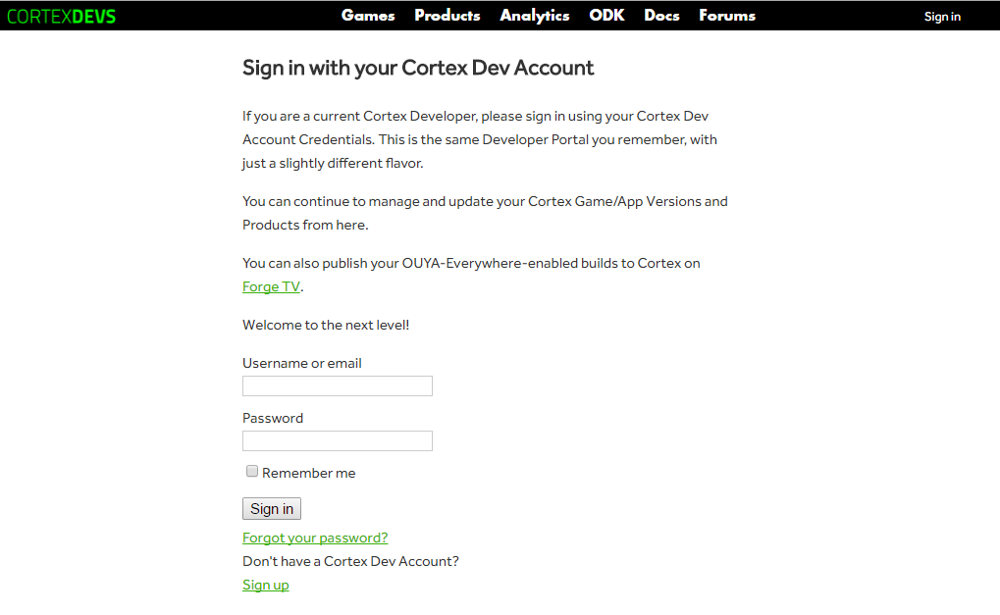
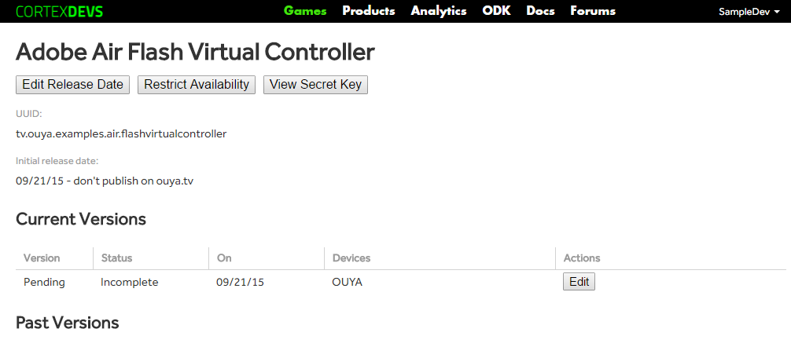

# Razer SDK

The `Razer SDK` provides an `API` to integrate controller input, access gamer info, request product information, check receipts, and trigger in-app-purchases.

## Create an account

## Developer Email

## Create Username

## Sign In

## Razer Account

## Add a New Game

## Game Entry

## View Secret Key

## Engines

The following engines have support for the `RazerSDK`.

### Adobe Air

`Adobe Air` apps can be built from `Animate CC` or `Flash Develop`. Adobe recently renamed their `Flash` product as `Animate CC` part of the `Adobe Creative Cloud` suite. The `RazerSDK` can be accessed via the `RazerSDK Native Extension`. For details and samples visit [https://github.com/razerofficial/adobe-air-razer-sdk](https://github.com/razerofficial/adobe-air-razer-sdk).

### Java

`Java` is common language supported by most `Android` game engines. The `RazerSDK` can be accessed via an Android Library. For details and samples visit [https://github.com/razerofficial/java-razer-sdk](https://github.com/razerofficial/java-razer-sdk).

### Unity

`Unity` is a popular game engine. The `RazerSDK` can be accessed via the `RazerSDK Unity Plugin`. For details and samples visit [https://github.com/razerofficial/unity-plugin-razer-sdk](https://github.com/razerofficial/unity-plugin-razer-sdk).
